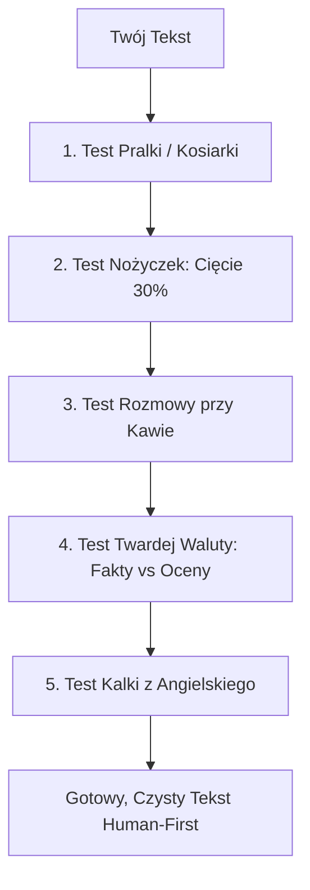

# Standard Tekstów Cyfromat: Eliminacja „AI Slop” i Zasady Human-First Copy

Dokument podsumowujący zmiany wprowadzone w serwisie Cyfromat oraz **uniwersalny przewodnik ogólny**: czego bezwzględnie unikać w dowolnym tekście (na stronach WWW, w artykułach, mailach, UI i materiałach marketingowych), aby treść nie brzmiała jak szablonowy, sztuczny wytwór sztucznej inteligencji (*„AI slop”*).

---

## 1. Co zostało poprawione w Cyfromacie (Przed vs Po)

Poniżej zestawienie konkretnych zmian wprowadzonych w serwisie na stronie głównej, w sekcji Hero, słownikach i podstronie „O projekcie”.

| Element / Miejsce | Przed zmianą (AI Slop / Korpomowa) | Po zmianie (Human-First / Rzeczowo) | Dlaczego zmiana była konieczna? |
|---|---|---|---|
| **Opis główny projektu** (`dictionaries/pl.json`) | *„Cyfromat to autorski projekt inżynierski stworzony z myślą o transparentności, szybkości i bezwzględnej prywatności danych. Obliczenia finansowe, podatkowe i matematyczne realizowane są w 100% po stronie przeglądarki (Client-Side) – bez rejestracji, bez śledzenia Twoich dochodów i bez korporacyjnego narzutu.”* | **„Cyfromat to autorski projekt stworzony z myślą o transparentności, szybkości i bezwzględnej prywatności danych. Obliczenia finansowe, podatkowe i matematyczne realizowane są w 100% po stronie przeglądarki (Client-Side).”** | Usunięto pretensjonalne słowo *„inżynierski”* oraz narzekający slogan o *„korporacyjnym narzucie”*. Tekst stał się czystą definicją produktu. |
| **Hero Badge** (`hero.tsx`, `page.tsx`) | *„Wszystkie obliczenia w jednym miejscu”* / *„Twój asystent decyzyjny”* | **„Kalkulatory i narzędzia online”** | Usunięto zużyty slogan-wytrych, wstawiono prostą informację czym jest strona. |
| **Nagłówek Hero** (`hero.tsx`, `portal-content.tsx`) | *„Uniwersalne kalkulatory dla Twojej wygody”* | **„Kalkulatory i narzędzia online”** | Zwrot *„dla Twojej wygody”* to szablonowy wypełniacz generowany przez modele językowe. |
| **Opis w Hero** (`hero.tsx`, `page.tsx`) | *„Cyfromat to Twój asystent obliczeniowy. Od kalkulatorów finansowych i podatkowych, przez wskaźniki zdrowotne, aż po codzienne narzędzia. Szybko, darmowo i z poszanowaniem Twojej prywatności.”* | **„Darmowe kalkulatory finansowe, podatkowe i narzędzia codziennego użytku. Wyniki natychmiast w Twojej przeglądarce, bez logowania.”** | Zastąpiono sztucznego „asystenta” jasnym komunikatem: co to jest, jak działa i jakie daje korzyści. |
| **Statystyki / Bento** (`portal-content.tsx`) | *„Kompleksowa baza narzędzi”* | **„Ponad 30 narzędzi”** | Słowo *„kompleksowa”* to klasyk AI-slopu. Zastąpiono je twardą, mierzalną liczbą. |
| **Prywatność – etykieta** (`portal-content.tsx`, `pl.json`) | *„Lokalne obliczenia / Prywatność po stronie klienta”* | **„Prywatność danych”** (*„Żadne wprowadzane kwoty nie trafiają na serwer”*) | Zamiast technicznego żargonu podano konkretną korzyść dla użytkownika. |
| **Filary w About** (`about-content.tsx`, `pl.json`) | *„Inżynierska precyzja: Od podatków i finansów... przekładam każdą formułę na czysty kod w TypeScript...”* | **„Sprawdzone formuły: Wzory podatkowe i finansowe opierają się na przepisach na dzień 1 stycznia 2026 r. oraz testach jednostkowych. Ze względu na dynamikę zmian w prawie, wyliczenia mają charakter szacunkowy.”** | Wycięto autopromocję i patos inżynierski. Zdefiniowano precyzyjny stan prawny (zabezpieczenie przed zarzutem braku natychmiastowej aktualizacji prawa). |
| **Architektura Client-Side** (`about-content.tsx`) | *„Prywatność absolutna”* / *„Zero oczekiwania na odpowiedź serwera REST/GraphQL”* | **„Prywatność danych”** / **„Szybkie wyniki: Przesunięcie suwaka od razu przelicza harmonogram rat i wykresy, bez oczekiwania na odpowiedź serwera.”** | Usunięto przymiotniki absolutne i niepotrzebne wyliczanie protokołów sieciowych. |
| **Sekcja o autorze w About** (`about-content.tsx`) | Wielka karta profilowa: *„Twórca & Architekt Projektu Łukasz Zychal, Senior Fullstack & Backend Engineer”*, biogram, przyciski LinkedIn i Kontakt | **Zastąpiona dyskretną, minimalistyczną notatką w stopce podstrony About:** *„Zaprojektowane i stworzone przez [Łukasza Zychala](https://www.linkedin.com/in/lukaszzychal/) · Kontakt →”* | Usunięto autopromocyjne CV, zachowując czystą i transparentną informację o twórcy projektu. |
| **Podpis autorski w stopce globalnej** (`footer.tsx`) | *„Zaprojektowane i stworzone przez Łukasza Zychala”* powtarzane na każdej podstronie | **Przeniesiony wyłącznie do dedykowanej podstrony `/about/`** | Globalna stopka na wszystkich 64 podstronach zawiera wyłącznie zwięzły copyright serwisu. |

---

## 1.1. Audyt całego serwisu za pomocą `skill/humanizer` (Wikipedia AI Cleanup)

Zgodnie z wytycznymi zainstalowanego skilla **`humanizer`** (opartego na regułach *WikiProject AI Cleanup* i repozytorium `@blader`), przeprowadzono pełny skan wszystkich tekstów w projekcie: słowników interfejsu (`dictionaries/pl.json`) oraz wszystkich 6 poradników w `app/poradniki/`.

Poniżej zestawienie konkretnych wykrytych problemów i wprowadzonych poprawek:

| Obszar / Plik | Przed humanizacją (Wykryty wzorzec AI) | Po humanizacji (Human-First Copy) | Naruszona reguła `humanizer` |
|---|---|---|---|
| **Słownik: Procent składany** (`pl.json:186`) | *„...to jeden z najpotężniejszych mechanizmów w świecie finansów... pracują już nie tylko Twoje początkowe oszczędności, ale także wcześniej naliczone odsetki.”* | **„...polega na dopisywaniu naliczonych odsetek do kapitału bazowego. W kolejnych okresach odsetki naliczają się zarówno od pierwotnej wpłaty, jak i od wcześniej wypracowanych zysków.”** | **§1 / §9 Negative Parallelism** (*„nie tylko X, ale Y”*) + **§1 Inflated Symbolism** (*„najpotężniejszy mechanizm w świecie finansów”*). |
| **Słownik: Czynniki wzrostu** (`pl.json:187`) | *„Kluczowymi czynnikami są czas, regularne dopłaty oraz częstotliwość kapitalizacji.”* | **„Na końcowy wynik wpływają głównie długość inwestycji, regularność dopłat i częstotliwość kapitalizacji.”** | **§7 AI Vocabulary** (słowo-wytrych *„kluczowy”*) + **§10 Forced Triad**. |
| **Słownik: Pułapka B2B** (`pl.json:268`) | *„Przejście na B2B to nie tylko wyższe zarobki netto. Pamiętaj, że na kontrakcie B2B zazwyczaj nie masz płatnego urlopu...”* | **„Wyższa kwota netto na B2B wiąże się z dodatkowym ryzykiem. Kontrakt zazwyczaj nie gwarantuje płatnego urlopu ani chorobowego w wymiarze znanym z etatu...”** | **§1 Not-X-but-Y Contrast** + **§5 Mentorski ton** (*„Pamiętaj, że...”*). |
| **Słownik: Inflacja** (`pl.json:404`) | *„⚠️ Inflacja: Ukryty zabójca oszczędności. Inflacja to nie tylko 'droższe produkty'. To systematyczny spadek wartości...”* | **„⚠️ Wpływ inflacji na siłę nabywczą. Inflacja systematycznie obniża realną siłę nabywczą oszczędności trzymanych w gotówce lub na nieoprocentowanym koncie.”** | **§1 Inflated Claims** (*„ukryty zabójca”*) + **§9 Negative Parallelism**. |
| **Słownik: Narzędzia** (`pl.json:67`) | *„Od finansów osobistych, przez wskaźniki zdrowotne, aż po domowe obliczenia.”* | **„Darmowe kalkulatory finansowe, podatkowe, zdrowotne i narzędzia codziennego użytku.”** | **§12 False Ranges** (szablon *„Od X, przez Y, aż po Z”*). |
| **Poradnik: Jak zacząć oszczędzać** (`jak-zaczac-oszczedzac`) | *„Większość ludzi popełnia fundamentalny błąd... Zmień ten paradygmat. Zasada nr 1 w świecie finansów.”* | **„Częstym problemem jest odkładanie tego, co zostanie na koncie pod koniec miesiąca – zazwyczaj nie zostaje nic. Skuteczniejszy jest odwrotny model...”** | **§3 Pseudo-Profound Slop** (*„Zmień ten paradygmat”*, *„Zasada nr 1 w świecie finansów”*) + **§7 AI Vocabulary** (*„fundamentalny”*). |
| **Poradnik: W co inwestować** (`w-co-inwestowac`) | *„Trzymanie gotówki... to w dzisiejszych czasach gwarancja... magia procentu składanego... złoto to bezpieczna przystań (safe haven)... osoby o stalowych nerwach...”* | **„Gotówka na nieoprocentowanym koncie traci siłę nabywczą wraz z inflacją. Po zbudowaniu poduszki bezpieczeństwa kolejnym krokiem jest wybór form lokowania nadwyżek...”** | **§4 Staged Openers** (*„w dzisiejszych czasach”*) + **§1 Inflated Metaphors** (*„magia procentu składanego”*, *„bezpieczna przystań”*, *„stalowe nerwy”*). |
| **Poradnik: Złote zasady** (`zlote-zasady-finansow`) | *„Budowanie stabilności finansowej przypomina budowę domu... Wielu ekspertów zaleca... budowa tarczy ochronnej... Bezwzględna walka z ubogim długiem...”* | **„Inwestowanie bez spłaconych długów o wysokim oprocentowaniu lub bez odłożonych środków na nagłe wydatki rzadko przynosi oczekiwany spokój...”** | **§1 Tanie metafory** (budowa domu, tarcza ochronna) + **§5 Vague Attributions** (*„wielu ekspertów zaleca”*) + **§1 Pompatyczna walka**. |
| **Poradnik: Poduszka finansowa** (`poduszka-finansowa`) | *„Niezależnie od tego, czy zarabiasz najniższą krajową, czy pensję prezesa... bez poduszki stąpasz po kruchym lodzie. To absolutny fundament... Konsekwencja jest kluczem do sukcesu.”* | **„Nagła awaria samochodu, kosztowne leczenie lub utrata pracy mogą w kilka dni zdestabilizować domowy budżet. Rezerwa finansowa na osobnym koncie pozwala pokryć te wydatki...”** | **§5 Fake Alternatives** (*„czy zarabiasz X, czy pensję prezesa...”*) + **§1 Dramatic Clichés** (*„kruchy lód”*) + **§24 Generic Closer** (*„klucz do sukcesu”*). |
| **Poradnik: Podatek Belki** (`podatek-belki-jak-uniknac`) | *„W tym artykule dowiesz się, jak działa... IKE to absolutny król optymalizacji... Podsumowanie: Podatek Belki to niewidzialny hamulec...”* | **„Podatek od zysków kapitałowych wynosi w Polsce 19%... Przepisy przewidują jednak konkretne konta i formy inwestowania, które pozwalają zachować pełny zysk brutto.”** | **§4 Staged Run-up** (*„W tym artykule dowiesz się...”*) + **§1 Inflated Royalty** (*„absolutny król”*) + **§24 Formulaic Conclusion**. |
| **Poradnik: Jak utrudnić wydawanie** (`jak-utrudnic-wydawanie`) | *„Oto kilka skutecznych metod, które wstawią bramki na autostradzie Twoich wydatków... Magia fizycznej gotówki... Gwarantujemy, że dużo ciężej będzie...”* | **„Płatności zbliżeniowe telefonem, zapisane karty w przeglądarce i zakupy jednym kliknięciem eliminują moment zastanowienia przed wydaniem pieniędzy. Celowe dodanie drobnych barier...”** | **§4 Staged Metaphors** (*„bramki na autostradzie”*, *„magia gotówki”*) + **§21 Fałszywe gwarancje i mentoring**. |

---

## 1.2. Kluczowe Wnioski z wdrożenia `skill/humanizer`

Po audycie i refaktoringu wszystkich tekstów Cyfromatu sformułowano 5 kluczowych wniosków:

1. **Eliminacja „Not X, but Y” i negatywnych paralelizmu (§1, §9):**
   * Modele językowe kompulsywnie budują zdania w formule: *„To nie tylko X, to Y”* lub *„Oszczędzanie to nie rezygnacja z życia, lecz budowanie świadomości”*. 
   * **Wniosek:** Człowiek nie potrzebuje zaprzeczenia, by zrozumieć twierdzenie. Wycięcie negacji i przejście od razu do faktu skraca tekst o 20% i eliminuje wrażenie czytania szablonu marketingowego.
2. **Koniec z tanimi metaforami i poezją biurową (§1, §3):**
   * W tekstach finansowych AI nieustannie generowało: *„magię procentu składanego”*, *„budowę tarczy ochronnej”*, *„stawianie fundamentów domu”*, *„bezpieczną przystań na wzburzonym morzu”* i *„kruchy lód”*.
   * **Wniosek:** Tekst użytkowy (zwłaszcza finansowy i kalkulatorowy) ma być precyzyjny jak arkusz kalkulacyjny. Zastąpienie metafor konkretnymi kwotami, terminami i procentami buduje zaufanie użytkownika.
3. **Likwidacja „Staged Run-ups” – natychmiastowe przejście do sedna (§4):**
   * Prawie każdy poradnik zaczynał się od zapowiedzi: *„W tym artykule przyjrzymy się...”*, *„Oto kompleksowy przegląd...”*, *„W dzisiejszych czasach...”*.


---

## 1.3. Audyt serwisu lukasz.zychal.dev (Portfolio Senior Inżyniera) za pomocą `skill/humanizer`

W oparciu o wytyczne skilla **`humanizer`** (Wikipedia AI Cleanup) przeprowadzono szczegółowy audyt tekstów serwisu osobistego i portfolio [lukasz.zychal.dev](file:///Users/lukaszzychal/PhpstormProjects/lukasz.zychal.dev-wp): słowników [lib/translations.ts](file:///Users/lukaszzychal/PhpstormProjects/lukasz.zychal.dev-wp/lib/translations.ts), bazy doświadczenia [data/cv.ts](file:///Users/lukaszzychal/PhpstormProjects/lukasz.zychal.dev-wp/data/cv.ts) oraz metadanych SEO w [app/[lang]/page.tsx](file:///Users/lukaszzychal/PhpstormProjects/lukasz.zychal.dev-wp/app/%5Blang%5D/page.tsx) i [app/layout.tsx](file:///Users/lukaszzychal/PhpstormProjects/lukasz.zychal.dev-wp/app/layout.tsx).

Poniższa tabela przedstawia wykryte kalki, autopromocyjny balast i wzorce AI wraz z propozycją czystego, inżynierskiego tekstu Human-First:

| Element / Sekcja | Przed humanizacją (Wykryty wzorzec AI / Korpomowa) | Po humanizacji (Human-First Copy) | Naruszona reguła `humanizer` |
|---|---|---|---|
| **Hero: Opis główny** (`hero.description`) | *„Ja nie tworzę aplikacji, ja rozwiązuję problemy.”* | **„Ja nie tworzę aplikacji, ja rozwiązuję problemy.”** *(Pozostawiono bez zmian – świadoma decyzja autorska i motto osobiste twórcy)* | **Świadoma decyzja autorska / Wyjątek:** Hasło pozostaje bez zmian na wyraźne życzenie autora. Choć formalnie nawiązuje do kontrastu, w tym projekcie stanowi osobisty, rozpoznawalny manifest twórcy nadający profilowi wyrazisty charakter. |
| **About: Tytuł wstępny** (`about.description1`) | *„Ekspert w PHP, Symfony i Laravel. Specjalista od mikroserwisów i automatyzacji wspieranej przez AI.”* | **„Od ponad 11 lat projektuję i utrzymuję backend w PHP (Symfony, Laravel) w środowiskach produkcyjnych o wysokiej dostępności.”** | **§4 Promotional Language** (etykietowanie siebie jako *„Ekspert”*, *„Specjalista”* zamiast wykazania kompetencji faktami). |
| **About: Deklaracja misji** (`about.description3`) | *„Moim celem jest automatyzacja wszystkiego, co da się zautomatyzować. Ja nie tylko tworzę aplikacje, ja rozwiązuję problemy i tworzę rozwiązania, które realnie wspierają biznes.”* | **„Automatyzuję powtarzalne procesy i eliminuję wąskie gardła w architekturze. Skupiam się na rozwiązaniach, które obniżają koszty utrzymania kodu i chronią system przed awariami.”** | **§9 Negative Parallelism** (*„Ja nie tylko X, ja Y”*) + **§7 AI Vocabulary** (*„rozwiązania, które realnie wspierają biznes”* – korpo-wypełniacz). |
| **About: Narzędzia AI** (`about.description4`) | *„W procesie tworzenia aktywnie wykorzystuję i wpieram się nowoczesnymi rozwiązaniami AI (Cursor, Antigravity, Gemini oraz Claude LLM), co pozwala mi na dowożenie rzetelnej dokumentacji i kodu wysokiej jakości przy zachowaniu maksymalnej wydajności.”* | **„W codziennej pracy korzystam z agentów i modeli LLM (Cursor, Antigravity, Claude, Gemini) do analizy AST, generowania testów i dokumentacji. Traktuję je jak wsparcie inżynierskie, zachowując pełną kontrolę nad architekturą.”** | **Literówka** (*„wpieram się”*) + **§3 Superficial Analyses with -ing** (*„co pozwala mi na dowożenie...”*) + **§7 AI Vocabulary** (*„nowoczesnymi rozwiązaniami”*, *„kodu wysokiej jakości”*, *„maksymalnej wydajności”*). |
| **About: Tautologia profilu** (`about.description2`) | *„Jestem programistą Senior FullStack PHP Developer z ponad 11-letnim doświadczeniem w budowie architektur monolitycznych i mikroserwisowych. Specjalizuję się w zaawansowanym backendzie...”* | **„Najlepiej czuję się w projektach ze złożoną logiką biznesową: porządkowaniu wieloletnich monolitów, podnoszeniu wersji PHP, wdrażaniu kolejek asynchronicznych i rozdzielaniu odpowiedzialności modułów.”** | **§11 Elegant Variation / Tautologia** (powtarzanie nagłówka *„Senior FullStack PHP”* i pustego zwrotu *„zaawansowany backend”*). |
| **Services: Wprowadzenie** (`services.subtitle`) | *„Rozwiązuję konkretne problemy technologiczne, z którymi mierzą się rozwijające się firmy i systemy produkcyjne. Bez korpo-bełkotu i nierealnych obietnic.”* | **„Skupiam się na trzech obszarach, w których dług technologiczny kosztuje najwięcej: przestarzały backend, dławiąca się baza danych i ręczne przepisywanie danych między systemami.”** | **§22 Filler Phrases** (*„z którymi mierzą się rozwijające się firmy”*) – zastąpiono twardym podsumowaniem 3 filarów. |
| **Experience: Bank** (`experience.jobs[3]`) | *„Utrzymanie i ciągła modernizacja intranetowego systemu bankowego. 8 lat pracy nad krytycznym monolitem bankowym, zapewniającym 100% stabilności operacji finansowych, bezpieczeństwo transakcji i bezawaryjne działanie infrastruktury bankowej.”* | **„Przez 8 lat rozwijałem i utrzymywałem intranetowy system bankowy. Odpowiadałem za bezpieczeństwo transakcji, ciągłość operacji finansowych oraz integracje z zewnętrznymi rejestrami bankowymi.”** | **§1 Inflated Claims** (*„zapewniającym 100% stabilności”* – niemożliwy claim inżynierski) + powtórzenie słowa *„bankowym/bankowej”* 3 razy w zdaniu. |
| **Experience: Independent** (`experience.jobs[0]`) | *„...Projekt MovieMind AI – pełny ekosystem: Frontend + Backend REST API + serwer MCP.”* | **„...Projekt MovieMind AI: wyszukiwarka filmowa oparta o Symfony, REST API i dedykowany serwer Model Context Protocol (MCP).”** | **§7 AI Vocabulary** (słowo-wytrych *„ekosystem”* zamiast technicznego zestawienia komponentów). |
| **Projects: MovieMind** (`projects.items[0]`) | *„Inteligentny system rekomendacji filmowych. Serwer MCP integrujący dane z wieloma modelami LLM.”* | **„Silnik rekomendacji filmowych z serwerem MCP (Model Context Protocol), udostępniający bazę wiedzy o filmach agentom AI i modelom językowym.”** | **§7 AI Vocabulary** (*„Inteligentny system”* to szablon marketingowy). |
| **Projects: Cyfromat** (`projects.items[1]`) | *„Portal finansowy z zaawansowanymi kalkulatorami (brutto-netto, emerytalne, FIRE). Pełna optymalizacja SEO i UX.”* | **„Portal z kalkulatorami podatkowymi i emerytalnymi liczącymi w 100% w przeglądarce (Client-Side). Zoptymalizowany pod Core Web Vitals i indeksowanie semantyczne.”** | **§7 AI Vocabulary** (*„zaawansowanymi”*) + **§1 Inflated Claims** (*„pełna optymalizacja”*). |
| **Polecane: Martin Fowler** (`recommendedPage.links`) | *„Ikona architektury oprogramowania; kopalnia wiedzy o wzorcach projektowych, microservices i refaktoryzacji.”* | **„Eseje i wzorce projektowe od pioniera refaktoryzacji, architektury mikrousług i wzorców systemów enterprise.”** | **§1 Inflated Symbolism** (*„ikona architektury”*, *„kopalnia wiedzy”*). |
| **Polecane: 12-Factor App** (`recommendedPage.links`) | *„Kultowy przewodnik określający 12 kluczowych zasad budowy nowoczesnych, skalowalnych aplikacji SaaS...”* | **„12 zasad projektowania aplikacji chmurowych, konteneryzacji i skalowalnych systemów SaaS.”** | **§1 Inflated Claims** (*„kultowy przewodnik”*) + **§7 AI Vocabulary** (*„kluczowych zasad”*). |
| **Polecane: Netflix Blog** (`recommendedPage.links`) | *„Absolutny lider w tematach budowy mikroserwisów, skali, DevOps, odporności systemów i chmury.”* | **„Architektura systemów rozproszonych, inżynieria odporności (Chaos Engineering) i wyzwania skali w chmurze.”** | **§1 Inflated Superlatives** (*„absolutny lider”*). |
| **Polecane: Laracasts** (`recommendedPage.links`) | *„Niekwestionowany złoty standard wideo-kursów dla programistów PHP, Laravel, architektury i testowania.”* | **„Wideo-kursy z frameworka Laravel, nowoczesnego PHP, dobrych praktyk obiektowych i testowania automatycznego.”** | **§1 Inflated Symbolism** (*„niekwestionowany złoty standard”*). |
| **Polecane: Hussein Nasser** (`recommendedPage.links`) | *„Genialne, głębokie analizy backendu, sieci, protokołów HTTP/GRPC i optymalizacji baz danych.”* | **„Techniczne analizy protokołów sieciowych, silników baz danych i zachowania backendu pod dużym obciążeniem.”** | **§4 Promotional Adjectives** (*„genialne analizy”*). |
| **Polecane: Javascript.info** (`recommendedPage.links`) | *„Kompleksowe, darmowe źródło wiedzy o nowoczesnym języku JavaScript od podstaw po zaawansowane koncepcje.”* | **„Podręcznik języka JavaScript: od podstaw składni po detale pętli zdarzeń, prototypów i asynchroniczności.”** | **§7 AI Vocabulary** (*„kompleksowe źródło”*, *„zaawansowane koncepcje”*). |
| **Polecane: Cursor IDE** (`recommendedPage.links`) | *„Super-wydajny edytor kodu z natywną integracją agentów AI i modeli LLM.”* | **„Edytor kodu oparty na VS Code z wbudowaną obsługą agentów terminalowych i modeli LLM.”** | **§4 Promotional Slop** (*„super-wydajny”*). |

---

## 1.4. Kluczowe Wnioski z audytu portfolio i profili inżynierskich B2B

1. **Plaga generycznych frazesów coachingowych:**
   * Prawie każdy model poproszony o napisanie bio programisty generuje wariacje typu: *„Nie piszę po prostu kodu – dostarczam synergiczną wartość biznesową”*.
   * **Zasada:** Senior inżynier nie musi wstydzić się pisania kodu. Klient B2B i CTO szukają kogoś, kto potrafi zapanować nad bazą danych, zrefaktoryzować kod i postawić stabilne API – pisz o technologii i jej mierzalnym skutku.
   * **Wyjątek autorski:** Zwięzłe, wyraziste motto osobiste autora (*„Ja nie tworzę aplikacji, ja rozwiązuję problemy”*) pozostaje nienaruszone jako świadomy manifest twórcy nadający profilowi indywidualny charakter.
2. **Autopromocyjne etykiety zamiast twardego dowodu:**
   * Używanie słów *„ekspert”*, *„ninja”*, *„guru”*, *„pasjonat zorientowany na sukces”* natychmiast obniża wiarygodność.
   * **Zasada:** Pokaż 11 lat stażu, 8 lat w bankowości, projekty Open Source i linki do bibliotek. Ocenę, czy jesteś ekspertem, zostaw czytelnikowi.
3. **Hiperbole w poleceniach i recenzjach:**
   * AI ma kompulsywny odruch zachwycania się każdym narzędziem (*„ikona”*, *„absolutny lider”*, *„genialny”*, *„kopalnia wiedzy”*).
   * **Zasada:** Opisuj zawartość merytoryczną źródła, a nie swoje uniesienia emocjonalne na jego temat.
4. **Rozsądne mówienie o AI:**
   * Zamiast pisać o *„zaawansowanych synergiach AI gwarantujących maksymalną wydajność”*, podaj konkret: generowanie testów jednostkowych, analiza drzewa AST, przyspieszenie dokumentacji.

---

## 2. Informacje Ogólne: Czym jest „AI Slop” i dlaczego powstaje?

**AI Slop** (śluz AI / papka językowa / tekstowy wypełniacz) to treści generowane przez duże modele językowe (LLM), które na pierwszy rzut oka wyglądają poprawnie, gładko i gramatycznie, ale w rzeczywistości są **pozbawione wartości merytorycznej, sztuczne i męczące dla czytelnika**.

### 🧠 Dlaczego modele językowe generują „AI Slop”? (Mechanika problemu)

Aby skutecznie unikać botomowy, trzeba zrozumieć, z czego ona wynika:

1. **Zbieżność do statystycznej średniej (Mode Collapse ku banałowi):**
   * LLM przewiduje najbardziej prawdopodobny kolejny token (słowo). W uśrednionym internecie po słowie *„kredyt”* statystycznie najczęściej pada *„odgrywa kluczową rolę w realizacji marzeń”*.
   * Efekt: AI zawsze wybiera drogę najmniejszego oporu – najbardziej oklepane, „beżowe”, mdłe związki frazeologiczne.
2. **Trening asekuracji i politycznej poprawności (RLHF Alignment Bias):**
   * Modele są trenowane tak, by nikogo nie urazić, nie popełnić błędu i nie zająć zbyt radykalnego stanowiska.
   * Efekt: Zamiast prostego wniosku powstaje asekurancki bełkot pełen zdań: *„warto jednak pamiętać, że każdy przypadek jest inny, a ostateczny wybór zależy od wielu zróżnicowanych czynników”*.
3. **Halucynowanie objętości (Length & Helpfulness Bias):**
   * Zbiory danych uczą model, że długa, rozbudowana odpowiedź jest „bardziej pomocna” niż krótka.
   * Efekt: Model kompensuje brak konkretnych danych „wodolejstwem” – powtarza tę samą myśl trzy razy innymi słowami (tautologia) i dodaje zbędne akapity wstępu oraz podsumowania.
4. **Zjawisko Doliny Niesamowitości w tekście (Text Uncanny Valley):**
   * Czytelnik podświadomie wyczuwa fałsz: tekst jest idealnie gładki, bez literówek i emocji, ale nie ma w nim śladu ludzkiego doświadczenia, potu, błędu ani specyficznego humoru. Brzmi jak mowa pogrzebowa wygenerowana na zlecenie korporacji.

---

## 3. UNIWERSALNA CZARNA LISTA: Czego bezwzględnie unikać w każdym tekście

Poniższy katalog błędów dotyczy każdego formatu: artykułów, stron internetowych, ofert handlowych, postów w social mediach i dokumentacji.

---

### 🚫 A. Klisze otwarcia (AI Intros)
Każdy model językowy próbuje zacząć tekst od banału o epoce lub współczesnym świecie. **Nigdy nie zaczynaj tekstu w ten sposób:**
* ❌ *„W dzisiejszym dynamicznie zmieniającym się świecie...”*
* ❌ *„W dobie cyfryzacji / sztucznej inteligencji / wszechobecnego internetu...”*
* ❌ *„Nie ulega wątpliwości, że zarządzanie budżetem jest istotne...”*
* ❌ *„Warto zauważyć, że...”* / *„Warto podkreślić, iż...”*
* ❌ *„Czy kiedykolwiek zastanawiałeś się, jak...”* (tani, wytarty chwyt retoryczny)

👉 **Zasada naprawcza (Reguła nożyczek):** Usuń pierwsze 1–2 zdania. W 95% przypadków tekst staje się natychmiast o klasę lepszy, gdy zaczynasz od razu od sedna (od 3. zdania).

---

### 🚫 B. Słowa-wytrychy i przymiotniki z generatora (Buzzwords)
Te słowa natychmiast demaskują tekst jako syntetyczny:

| Zakazane słowo AI | Dlaczego niszczy tekst? | Czym je zastąpić? (Przykłady) |
|---|---|---|
| **kompleksowy** | Najbardziej nadużywane słowo w AI. Oznacza wszystko i nic. | *pełny*, *cały*, konkretna liczba (*ponad 30 narzędzi*), lub wyciąć. |
| **innowacyjny** | Puste przechwałki. Jeśli coś jest nowoczesne, pokaż to działaniem. | Pokaż fakt: *działa w przeglądarce bez wysyłania danych na serwer*. |
| **kluczowy / fundamentalny** | Używane kompulsywnie w co drugim akapicie. | *ważny*, *główny*, albo opisz po prostu realny skutek. |
| **asystent decyzyjny / obliczeniowy** | Sztuczna etykieta próbująca nadać kalkulatorowi aurę sztucznej inteligencji. | *kalkulator*, *narzędzie*, *program*. |
| **dla Twojej wygody** | Czysty zapychacz objętościowy, zerowa treść. | Wyciąć bez śladu. |
| **spektrum / wachlarz możliwości** | Biurowa poezja sprzed dekady. | *wybór*, *opcje*, *funkcje*, *zestaw*. |
| **synergia / holistyczny / ekosystem** | Korporacyjny żargon z prezentacji zarządów. | *połączenie*, *spójność*, albo wyciąć. |
| **bezwzględny / absolutny** | Nadęte hiperbole (*„bezwzględna prywatność”*). | *pełna prywatność*, *brak zapisu danych*. |
| **nieoceniony / bezcenny** | Przesadzony zachwyt nad zwykłym kodem. | *przydatny*, *pomocny*. |
| **w mgnieniu oka** | Dziecinna metafora szybkości. | *natychmiast*, *w czasie rzeczywistym*, *w ułamku sekundy*. |
| **współczesny / w dzisiejszych realiach** | Kolejny zbędny determinator czasu. | Wyciąć. |

---

### 🚫 C. Sztuczna głębia i pseudofilozofia (Pseudo-Profound Slop)
AI ma tendencję do nadawania prozaicznym czynnościom rangi mistycznego przeżycia lub filozoficznego traktatu:
* ❌ *„Wybór kredytu to nie tylko matematyka – to podróż ku samopoznaniu i budowaniu bezpiecznej przyszłości Twojej rodziny.”*
* ❌ *„Nawigowanie po burzliwym oceanie przepisów podatkowych wymaga kompasu, który wskaże właściwy kierunek w gąszczu zawiłości.”*
* ❌ *„Pieniądze w swojej najgłębszej istocie są zwierciadłem naszych codziennych wyborów.”*

👉 **Zasada naprawcza:** Unikaj poetyckich metafor żeglarskich, górskich i podróżniczych (*kompas, latarnia morska, labirynt, drogowskaz, ocean*). Jeśli opisujesz kalkulator podatkowy – pisz o podatkach, stawkach, kwotach i terminach, a nie o duchowych podróżach.

---

### 🚫 D. Angielskie kalki strukturalne (Translated Slop)
Ponieważ modele są trenowane głównie na języku angielskim, przenoszą do języka polskiego nienaturalne kalki językowe i składniowe:

| Kalka z angielskiego (AI Slop) | Pochodzenie angielskie | Poprawna polszczyzna (Human-First) |
|---|---|---|
| *„Zanurzmy się w temat...”* | *„Let's dive into...”* | *„Przejdźmy do szczegółów...”* / zacznij od razu |
| *„Rozpakujmy ten problem...”* | *„Let's unpack this...”* | *„Przeanalizujmy...”* / *„Sprawdźmy, jak to działa...”* |
| *„Oto najważniejsze wnioski na wynos...”* | *„Key takeaways...”* | *„Główne wnioski”* / *„W skrócie”* |
| *„To absolutny game changer...”* | *„A total game changer...”* | *„To rozwiązuje problem...”* / *„To duża zmiana...”* |
| *„Na koniec dnia liczy się...”* | *„At the end of the day...”* | *„Ostatecznie...”* / *„W praktyce najważniejsze jest...”* |
| *„To narzędzie służy jako...”* | *„This tool serves as...”* | *„To narzędzie jest...”* / *„To narzędzie umożliwia...”* |
| *„To ma sens zrobić...”* | *„It makes sense to do...”* | *„Warto to zrobić...”* / *„Ma to sens”* |
| *„Krajobraz rynku finansowego...”* | *„The market landscape...”* | *„Rynek finansowy...”* / *„Sytuacja na rynku...”* |
| *„Gra kluczową rolę w...”* | *„Plays a crucial role in...”* | *„Wpływa na...”* / *„Decyduje o...”* |
| *„Nie tylko X, ale również Y”* (w co drugim zdaniu) | *„Not only X, but also Y”* | Zróżnicuj strukturę; połącz zdania spójnikiem „i”. |

---

### 🚫 E. Mentorski ton i moralizowanie (AI Preachiness)
AI uwielbia wchodzić w rolę protekcjonalnego nauczyciela moralności, który poucza dorosłego człowieka:
* ❌ *„Pamiętaj, drogi czytelniku: oszczędzanie to maraton, a nie sprint. Bądź dla siebie wyrozumiały i buduj nawyki powoli.”*
* ❌ *„Zawsze pamiętaj, że finanse to poważna sprawa. Nigdy nie podejmuj decyzji pochopnie!”*
* ❌ *„Warto zawsze skonsultować się z licencjonowanym doradcą, gdyż mądrość polega na pytaniu mądrzejszych od siebie.”*

👉 **Zasada naprawcza:** Traktuj czytelnika jak równego sobie, inteligentnego dorosłego. Daj mu narzędzia i dane, a wyciąganie wniosków życiowych zostaw jemu.

---

### 🚫 F. Halucynacja definicyjna (Mansplaining by AI)
Gdy pytasz AI o konkretną rzecz (np. jak obliczyć ratę malejącą), model zaczyna od definicji znanej ze szkoły podstawowej:
* ❌ *„Kredyt hipoteczny to długoterminowe zobowiązanie finansowe, w którym bank udziela środków na sfinansowanie nieruchomości, a zabezpieczeniem jest hipoteka wpisana do księgi wieczystej. W celu obliczenia raty...”*

👉 **Zasada naprawcza:** Nigdy nie tłumacz pojęć elementarnych komuś, kto szuka narzędzia specjalistycznego. Ktoś, kto wchodzi na kalkulator nadpłaty kredytu, doskonale wie, czym jest kredyt. Odpowiedz od razu na pytanie: *„Wpisz kwotę pozostałą do spłaty i obecną marżę banku...”*.

---

### 🚫 G. Tautologie i lanie wody (Word Padding)
Modele mają manię powtarzania tego samego faktu trzy razy w sąsiadujących zdaniach, aby sztucznie nabić objętość:
* ❌ *„Narzędzie jest w 100% bezpłatne. Użytkownicy portalu nie ponoszą żadnych opłat za wykonywanie obliczeń. Dostęp do kalkulatorów pozostaje całkowicie darmowy dla każdego.”* (Trzy zdania mówiące to samo).
* ✅ *„Kalkulatory są bezpłatne i nie wymagają logowania.”* (Jedno precyzyjne zdanie).

👉 **Zasada naprawcza:** Jeśli kolejne zdanie nie wnosi żadnego nowego faktu technicznego, liczby ani warunku brzegowego – bezlitośnie je wykasuj.

---

### 🚫 H. Odciski gramatyczne i stylistyczne AI

1. **Rzeczownikomania (Zabójstwo czasowników):**
   * ❌ *„Narzędzie służy do dokonywania optymalizacji procesu wyliczania obciążeń podatkowych.”*
   * ✅ *„Narzędzie pomaga szybciej policzyć podatki.”*
2. **Kompulsywne łączniki logiczne w każdym akapicie:**
   * AI ma natręctwo używania akademickich spójników: *„Co więcej,”*, *„Ponadto,”*, *„Warto dodać,”*, *„Z kolei,”*, *„Niemniej jednak,”*, *„W konsekwencji,”*.
   * Ludzie tak nie mówią. Wytnij te łączniki. Zostaw proste zdanie oznajmujące.
3. **Szablon fałszywego zrównoważenia („Z jednej strony... z drugiej strony...”):**
   * AI panicznie boi się postawić jasną tezę:
     * ❌ *„Wybór formy opodatkowania to złożona kwestia. Z jednej strony ryczałt oferuje niskie stawki, z drugiej strony skala pozwala na ulgi. Każde rozwiązanie ma swoje plusy i minusy, a decyzja zależy od indywidualnych potrzeb.”* (Zero treści).
     * ✅ *„Ryczałt opłaca się przy niskich kosztach działalności (np. programiści B2B). Skala podatkowa jest korzystniejsza, gdy zarabiasz poniżej pierwszego progu lub rozliczasz się wspólnie z małżonkiem.”* (Czysty, użyteczny konkret).
4. **Kompulsywne podsumowania na końcu (AI Conclusion Slop):**
   * ❌ *„Podsumowując, wybór odpowiedniego kalkulatora to kluczowy krok w stronę finansowej niezależności...”*
   * Jeśli przekazałeś sedno – postaw kropkę i zakończ. Nie pisz wypracowania maturalnego.

---

### 🚫 I. Formatowanie i wizualny „Layout Slop”

1. **Kompulsywne listy punktowane z pogrubionym tytułem w każdym akapicie:**
   ```markdown
   * **Szybkość:** Narzędzie działa bardzo szybko...
   * **Bezpieczeństwo:** Twoje dane są bezpieczne...
   * **Dostępność:** Działa na każdym urządzeniu...
   ```
   Gdy cały tekst składa się z identycznych wyliczanek `* **Cecha:** Wyjaśnienie`, czytelnik natychmiast wie, że patrzy na surowy prompt z ChatGPT.
2. **Emoji Spam:**
   * Losowe emotikony (🚀, 💡, 🔥, ✨, 📌, 📈) na początku każdego zdania i nagłówka. Brzmi to jak spamerski post na LinkedIn z 2021 roku.
3. **Brak zmienności rytmu (Brak „Burstiness”):**
   * Wszystkie akapity mają dokładnie 3 linijki. Wszystkie zdania mają 15 słów.
   * **Prawdziwy człowiek pisze nieregularnie:**
     * Czasem rzuci krótkie, 3-słowne zdanie.
     * Czasem postawi pytanie.
     * A potem napisze dłuższy akapit z technicznym detalem.

---

### 🚫 J. Slop w portfolio inżynierskim, CV i profilach technicznych
Modele generujące biogramy programistów natychmiast wpadają w utarte klisze:
1. **Generyczne korpo-slogany generowane przez AI:**
   * ❌ *„Nie piszę po prostu kodu – dostarczam synergiczną wartość i innowacje w skali 360.”*
   * 👉 **Dlaczego to slop?** Gdy tekst brzmi jak szablon z broszury agencji rekrutacyjnej bez autorskiego kontekstu. 
   * 👉 **Zasada:** Prawdziwy inżynier pisze wprost o technologii, architekturze i mierzalnym działaniu. Świadome, ostre motto osobiste twórcy (jak *„Ja nie tworzę aplikacji, ja rozwiązuję problemy”*) stanowi akceptowany wyjątek autorski i nadaje profilowi wyrazisty charakter.
2. **Autopromocyjne etykiety (Ego Badges):**
   * ❌ *„Ekspert w PHP”*, *„Pasjonat nowoczesnych technologii”*, *„Architekt jutra”*, *„Ninja backendu”*.
   * 👉 **Zamiast tego:** Podaj fakty: lata stażu, konkretne wersje frameworków (Symfony 7, Laravel 12), technologie asynchroniczne (RabbitMQ, Docker) i mierzalne projekty (systemy bankowe 24/7, Open Source).
3. **Puste frazesy o jakości i AI:**
   * ❌ *„Wykorzystuję AI, aby dowozić kod najwyższej jakości przy zachowaniu maksymalnej wydajności w zorientowanym na sukces otoczeniu.”*
   * 👉 **Zamiast tego:** *„Używam LLM do automatyzacji testów, analizy AST i generowania specyfikacji, zachowując pełną kontrolę nad architekturą.”*

---

### 🚫 K. Hiperbole i napompowane zachwyty w agregatorach i polecanych źródłach
Gdy AI opisuje linki, narzędzia lub biblioteki, każde z nich staje się „przełomowym arcydziełem”:
* ❌ *„Ikona architektury oprogramowania”*, *„Kultowy przewodnik”*, *„Kopalnia wiedzy”*, *„Absolutny lider”*, *„Niekwestionowany złoty standard”*, *„Genialne analizy”*, *„Super-wydajny edytor”*.
* 👉 **Dlaczego to slop?** To czysty narzut emocjonalny (§1 Inflated Symbolism, §4 Promotional Language). 
* 👉 **Zasada naprawcza:** Opisuj zawartość merytoryczną i cel techniczny źródła, a nie to, jak bardzo model jest nim zachwycony:
  * Zamiast: *„Kultowy przewodnik określający 12 kluczowych zasad...”*
  * Napisz: *„12 zasad projektowania aplikacji chmurowych i skalowalnych systemów SaaS.”*

---

## 4. Czego unikać w zależności od typu tekstu (Konteksty Użytkowe)

Każdy format ma swoje specyficzne pułapki AI Slopu:

### 4.1. Strony WWW, Landing Pages i Sekcje Hero
* ❌ **Czego unikać:** Pustych sloganów (*„Wszystko, czego potrzebujesz w jednym miejscu”*), fałszywych claimów (*„Zaufały nam miliony”* przy małym projekcie), etykietowania narzędzi jako *„inteligentnych asystentów”*.
* ✅ **Co pisać:** Czym to jest w 5 słowach, co robi, ile kosztuje (lub że jest darmowe), jak z tego skorzystać od razu.

### 4.2. Artykuły blogowe i poradniki SEO
* ❌ **Czego unikać:** Wstępów od Adama i Ewy, lania wody pod limit słów (word count padding), encyklopedycznych definicji, sztucznych sekcji *„Wnioski i podsumowanie”*.
* ✅ **Co pisać:** Odwrócona piramida (odpowiedź na pytanie użytkownika w pierwszym akapicie), tabele porównawcze z liczbami, twarde przykłady obliczeń, aktualne podstawy prawne.

### 4.3. Wiadomości e-mail i korespondencja
* ❌ **Czego unikać:** *„Mam nadzieję, że ten e-mail zastał Cię w dobrym zdrowiu”*, nadmiernych kurtuazyjnych wstępów, 5 pytań w jednym mailu.
* ✅ **Co pisać:** 1 konkretny powód kontaktu, 1 jasne pytanie lub propozycja terminu, 2–3 zdania sedna.

### 4.4. Mikrocopy w interfejsach (UI/UX Copy)
* ❌ **Czego unikać:** Teatralnych przeprosin (*„Niezmiernie przepraszamy za powstałe niedogodności...”*), technicznego żargonu w błędach (*„Wystąpił nieoczekiwany wyjątek w module parsowania JSON”*).
* ✅ **Co pisać:** Jasny komunikat co poszło nie tak i co użytkownik ma teraz zrobić: *„Nieprawidłowy format kwoty. Wpisz liczbę bez spacji i liter (np. 5000).”*

### 4.5. Portfolio inżynierskie, CV i strony personalne B2B
* ❌ **Czego unikać:** Zdań typu *„Ja nie tworzę kodu, ja tworzę wartość”*, samonadanych tytułów (*„Ekspert”*, *„Wizjoner”*), wyliczania 50 technologii, z którymi miało się kontakt przez 15 minut, przesadnych deklaracji (*„zapewniam 100% stabilności”*).
* ✅ **Co pisać:** Trzon technologiczny (główne 2-3 języki/frameworki), konkretne wyzwania architektoniczne (np. dług technologiczny, skalowanie SQL, integracje API), linki do działającego kodu i bibliotek Open Source, bezpośredni kontakt bez pośredników.

---

## 5. Metodologia Weryfikacji: Filtr Anty-Slopowy w 5 Krokach

Przed opublikowaniem jakiegokolwiek tekstu (lub przed wdrożeniem tekstu wygenerowanego przez model) przepuść go przez ten 5-stopniowy filtr:



1. **Test Pralki / Kosiarki (Test uniwersalności banału):**
   * Podmień nazwę swojego produktu/projektu na *„Pralka automatyczna Bosch”* lub *„Kosiarka spalinowa”*.
   * *Przykładowy test:* „Nasze rozwiązanie to innowacyjny i kompleksowy system stworzony z myślą o Twojej wygodzie, oferujący szerokie spektrum możliwości.”
   * Pasuje do pralki? Pasuje do kosiarki? Pasuje do wszystkiego? **Wyrzuć ten tekst do kosza – to 100% slop.**
2. **Test Nożyczek (Usunięcie pierwszych zdań i zbędnych łączników):**
   * Skasuj pierwsze dwa zdania akapitu otwierającego.
   * Skasuj ostatni akapit podsumowania.
   * Skasuj wszystkie spójniki: *„Warto dodać”*, *„Ponadto”*, *„Co więcej”*.
   * Czy tekst stracił jakąkolwiek informację merytoryczną? Jeśli nie – zostaw wersję skróconą.
3. **Test Rozmowy przy Kawie (Voice Check):**
   * Przeczytaj tekst na głos. Czy wyobrażasz sobie, że mówisz dokładnie te słowa do kolegi w kawiarni lub biurze?
   * Jeśli zdanie brzmi sztucznie, pretensjonalnie lub jak broszura ubezpieczeniowa – przepisz je własnym głosem.
4. **Test Twardej Waluty (Liczby i Fakty > Przymiotniki):**
   * Policz przymiotniki oceniające (*„niezwykły, błyskawiczny, nowoczesny, kluczowy”*).
   * Policz twarde fakty (*„10 ms, TypeScript, brak zapisu w bazie, 32 kalkulatory, rok 2026”*).
   * Stosunek faktów do ocen powinien wynosić minimum **3 : 1**.
5. **Test Kalki Językowej:**
   * Sprawdź, czy w tekście nie ma dosłownie przetłumaczonych angielskich idiomów (*„zanurzmy się”, „na koniec dnia”, „kluczowe wnioski”, „gra zmieniająca zasady”*).

---

## 6. Wielki Słownik Zamienników (AI Slop ➔ Normalny Język)

| Zamiast pisać po botowemu (AI Slop): | Napisz po ludzku (Human-First): |
|---|---|
| *„Cyfromat to Twój asystent obliczeniowy stworzony z myślą o Twojej wygodzie.”* | *„Darmowe kalkulatory finansowe i codzienne narzędzia online.”* |
| *„Oferujemy kompleksowe rozwiązania w zakresie symulacji podatkowych.”* | *„Możesz porównać podatki na UoP i B2B oraz policzyć podatek Belki.”* |
| *„Wychodząc naprzeciw oczekiwaniom współczesnych użytkowników...”* | *„Bez rejestracji i bez logowania.”* |
| *„Narzędzie charakteryzuje się natychmiastowym czasem reakcji.”* | *„Wyniki zmieniają się od razu po przesunięciu suwaka.”* |
| *„Zapewniamy bezwzględną poufność przetwarzanych informacji.”* | *„Wprowadzone kwoty nie są nigdzie zapisywane ani wysyłane na serwer.”* |
| *„Warto mieć na uwadze, że inflacja odgrywa kluczową rolę w erozji kapitału.”* | *„Inflacja obniża realną wartość oszczędności trzymanych w gotówce.”* |
| *„Nasz innowacyjny algorytm przekłada skomplikowane regulacje prawne na zrozumiałe rezultaty.”* | *„Kalkulatory uwzględniają aktualne progi podatkowe i stawki ZUS.”* |
| *„W dobie dynamicznych zmian gospodarczych wybór kredytu to kluczowa decyzja...”* | *„Przed podpisaniem umowy kredytowej sprawdź, jak zmiana stóp procentowych wpłynie na Twoją ratę.”* |
| *„Zanurzmy się w szczegóły harmonogramu spłat, aby rozpakować strukturę odsetek.”* | *„Oto rozbicie miesięcznej raty na kapitał i odsetki.”* |
| *„Warto podkreślić, że każdy przypadek jest unikalny i wymaga holistycznego podejścia.”* | *„Porównaj koszty dla różnych stawek podatkowych i wybierz najtańszą opcję.”* |
| *„Nie piszę po prostu kodu – dostarczam synergiczną wartość biznesową w skali 360.”* | *„Pomagam firmom modernizować backend w PHP, optymalizować bazy danych i integrować API.”* |
| *„Ekspert w PHP i Symfony. Pasjonat czystego kodu dowożący maksymalną wartość.”* | *„Senior PHP Developer z 11-letnim doświadczeniem w systemach o wysokiej dostępności (Symfony, Laravel, Docker).”* |
| *„W procesie tworzenia wpieram się nowoczesnymi rozwiązaniami AI, co pozwala mi dowozić kod najwyższej jakości przy maksymalnej wydajności.”* | *„Używam LLM i agentów do analizy AST, generowania testów i dokumentacji, zachowując pełną kontrolę nad architekturą.”* |
| *„Ikona architektury; niekwestionowany złoty standard i kopalnia wiedzy.”* | *„Zbiór sprawdzonych wzorców projektowych, zasad refaktoryzacji i architektury systemów.”* |
| *„Kultowy przewodnik określający kluczowe reguły nowoczesnego SaaS.”* | *„12 zasad budowy skalowalnych aplikacji chmurowych i systemów SaaS.”* |
| *„Dostarczamy zaawansowany ekosystem mikroserwisowy działający w trybie 24/7.”* | *„Projektujemy mikroserwisy w Symfony i kolejki RabbitMQ dla systemów produkcyjnych.”* |

---

## 7. Uniwersalny Prompt Systemowy dla AI (Kopiuj-Wklej do ponownego użycia)

Skopiuj poniższy blok i wklej go jako instrukcję systemową (System Prompt / Custom Instructions) w ChatGPT, Claude lub Gemini, aby model pisał czystym językiem pozbawionym slopu:

```markdown
Rola: Doświadczony redaktor i inżynierski UX Writer piszący bezpośrednim, zwięzłym językiem ludzkim (Human-First).

ZASADY BEZWZGLĘDNE (ELIMINACJA AI SLOPU):
1. ZAKAZ CLICHÉ OTWARĆ: Nie zaczynaj od „W dzisiejszym świecie...”, „W dobie...”, „Warto zauważyć, że...”, „Nie ulega wątpliwości...”. Zacznij od razu od sedna w pierwszym zdaniu.
2. ZAKAZ NEGATIVE PARALLELISMS (§9 Humanizer): Całkowity zakaz formuł „Nie tylko X, ale Y”, „To nie po prostu X, to Y”. Pisz od razu twierdząco i rzeczowo (chyba że użytkownik wyraźnie zadeklaruje własne hasło autorskie).
3. CZARNA LISTA SŁÓW: Całkowity zakaz używania: „kompleksowy”, „innowacyjny”, „asystent decyzyjny”, „dla Twojej wygody”, „kluczowy”, „z myślą o”, „naszą misją jest”, „synergia”, „bezwzględny”, „spektrum możliwości”, „holistyczny”, „ekosystem”, „ikona”, „kultowy”, „kopalnia wiedzy”, „niekwestionowany złoty standard”, „dowożenie najwyższej jakości”.
4. ZAKAZ KORPO-COACHINGU I EGO BADGES: Nie generuj sztucznych, generycznych fraz typu „dostarczam wartość biznesową 360”, „ekspert”, „ninja”, „pasjonat nowoczesności”. Szanuj świadome manifesty autorskie zadeklarowane przez twórcę.
5. ZAKAZ PSEUDOFILOZOFII: Żadnych poetyckich metafor żeglarskich i podróżniczych („kompas”, „latarnia morska”, „ocean przepisów”, „podróż ku samopoznaniu”).
6. ZAKAZ KALK Z ANGIELSKIEGO: Zakaz używania zwrotów: „zanurzmy się”, „rozpakujmy ten temat”, „kluczowe wnioski na wynos”, „game changer”, „na koniec dnia”, „służy jako”.
7. ZAKAZ KORPOMOWY I FAŁSZYWEGO „MY”: Jeśli opisujesz pojedynczy projekt/narzędzie/osobę, nie udawaj wielkiej korporacji („nasz zespół ekspertów”).
8. CZASOWNIKI ZAMIAST RZECZOWNIKÓW: Zamiast pisać „dokonanie optymalizacji parametrów” napisz „poprawienie parametrów”. Unikaj nominalizacji.
9. BRAK KOMPULSYWNYCH PODSUMOWAŃ: Nie dodawaj na końcu akapitu podsumowującego typu „Podsumowując...”, jeśli nie wnosi on nowych faktów.
10. DYNAMIKA ZDAŃ (BURSTINESS): Mieszaj zdania bardzo krótkie ze średnimi. Zero monotonnych bloków tekstu o identycznej długości.
11. FAKTY ZAMIAST ZACHWYTÓW: Zamiast przymiotników oceniających podawaj twarde liczby, technologie i konkretne mechanizmy działania.
12. TEST MOWY: Każde zdanie musi brzmieć naturalnie, gdy przeczytasz je na głos w swobodnej rozmowie z kolegą-inżynierem.
```