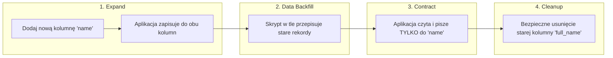

# Database Migration Guard & Zero-Downtime Architect
> **Autor / Twórca:** Łukasz / Lukasz Zychal

Ten skill służy do **bezpiecznego projektowania, weryfikacji i wdrażania migracji bazodanowych** (SQL i NoSQL: PostgreSQL, MySQL, SQLite, MongoDB itp.) przy użyciu dowolnych narzędzi (Alembic, Prisma, Flyway, Liquibase, Django ORM, Phinx/Doctrine). Chroni przed przestojami produkcyjnymi (Downtime), blokowaniem tabel i utratą danych.

---

## 🎯 Kiedy aktywować ten skill?
- Użytkownik prosi o: "napisz migrację bazy danych", "jak bezpiecznie zmienić nazwę kolumny", "sprawdź migrację", "migracja bez downtime'u (Zero-Downtime)".
- Dodawanie, usuwanie lub modyfikowanie kolumn, tabel, kluczy obcych i indeksów na działającej bazie produkcyjnej.
- Przygotowywanie procedury awaryjnego wycofania zmian (Rollback Plan).

---

## 🏗️ Wzorzec Expand and Contract (Klucz do Zero-Downtime)

W systemie o wysokiej dostępności (HA) nowa wersja kodu aplikacji jest wdrażana stopniowo (Rolling update / Canary / Blue-Green). Oznacza to, że przez pewien czas **stara wersja aplikacji i nowa wersja aplikacji działają jednocześnie na tej samej bazie danych**.

### Przykład: Zmiana nazwy kolumny `full_name` -> `name`

❌ **Błąd krytyczny:** Wykonanie pojedynczego `ALTER TABLE users RENAME COLUMN full_name TO name;` natychmiast wywali działające jeszcze instancje starej aplikacji błędem 500 (`column full_name does not exist`).

---

## ⚠️ Najczęstsze Pułapki i Blokady Tabel (Locking Pitfalls)

### 1. Tworzenie Indeksów na Dużych Tabelach
- ❌ `CREATE INDEX idx_users_email ON users(email);`
  - W PostgreSQL i MySQL blokuje zapisy do tabeli na czas budowania indeksu (może trwać od minut do godzin).
- ✅ **Rozwiązanie (PostgreSQL):**
  - `CREATE INDEX CONCURRENTLY idx_users_email ON users(email);`
  - Tworzy indeks bez blokowania odczytów ani zapisów (wymaga wyłączenia pojedynczej transakcji w narzędziu migracyjnym, np. `transaction_per_migration = False` w Alembic).

### 2. Dodawanie Kolumn z Wymogiem `NOT NULL`
- ❌ `ALTER TABLE orders ADD COLUMN status VARCHAR(20) NOT NULL;`
  - Zakończy się błędem, jeśli w tabeli istnieją już wiersze (brak wartości domyślnej) lub zablokuje całą tabelę przy przepisywaniu.
- ✅ **Bezpieczna procedura 3-etapowa:**
  1. Dodaj kolumnę jako dopuszczającą `NULL` (z wartością domyślną): `ADD COLUMN status VARCHAR(20) DEFAULT 'PENDING';`
  2. Zaktualizuj ewentualne stare rekordy w małych paczkach (batching).
  3. Dodaj ograniczenie `NOT NULL`: `ALTER TABLE orders ALTER COLUMN status SET NOT NULL;`

### 3. Zmiana Typu Kolumny
- Zmiana typu kolumny (np. `INT` -> `BIGINT`) często wymusza przepisanie całej tabeli na dysku (Table Rewrite) i blokuje bazę.
- Zamiast tego zastosuj wzorzec Expand-and-Contract (utwórz nową kolumnę o docelowym typie, zsynchronizuj dane i podmień referencje).

---

## 🔄 Żelazna Zasada Odwracalności (Rollback / Down Migration)

Każdy plik migracji MUSI implementować lustrzaną funkcję `down` (lub `downgrade`):
- Jeśli w `up` tworzysz tabelę `CREATE TABLE logs`, w `down` MUSI być `DROP TABLE logs;`.
- Jeśli w `up` dodajesz indeks, w `down` MUSI być `DROP INDEX ...;`.
- **Weryfikacja:** Zawsze przetestuj lokalnie pełny cykl: `migrate up` -> `migrate down` -> `migrate up`. Upewnij się, że schemat po cofnięciu jest w 100% identyczny ze stanem wyjściowym.

---

## 📋 Checklista Oceny Nowej Migracji
- [ ] Czy migracja jest wstecznie kompatybilna z aktualnie działającą na produkcji wersją aplikacji?
- [ ] Czy tworzenie indeksów na dużych tabelach korzysta z flagi `CONCURRENTLY` (Postgres) lub `ALGORITHM=INPLACE, LOCK=NONE` (MySQL)?
- [ ] Czy dodawanie kolumn `NOT NULL` zawiera bezpieczną wartość domyślną?
- [ ] Czy migracja zawiera precyzyjną, przetestowaną procedurę `down` (rollback)?
- [ ] Czy migracja danych (backfill) została oddzielona od migracji schematu DDL?
